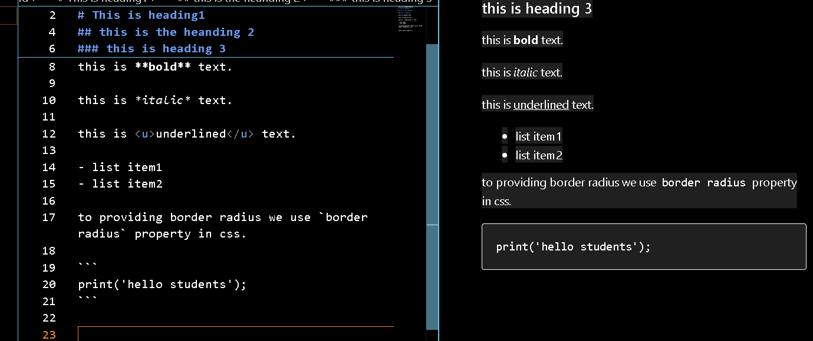

# spaceship....

welcome to my website..

this is the open source project..and this serve as a handbook for various  technologies...!

whether you're science student.this repo will be your go resource for all the languages like c++, c, python, html, java...

- here i use random image

## how to contribute?
  
  welcome contributions from the community to help us expand.

  1.fork the repository to your github account.
  
  2.make your changes.

  3.open a new pull request in this repository.
 